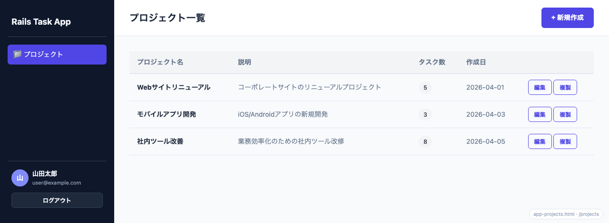
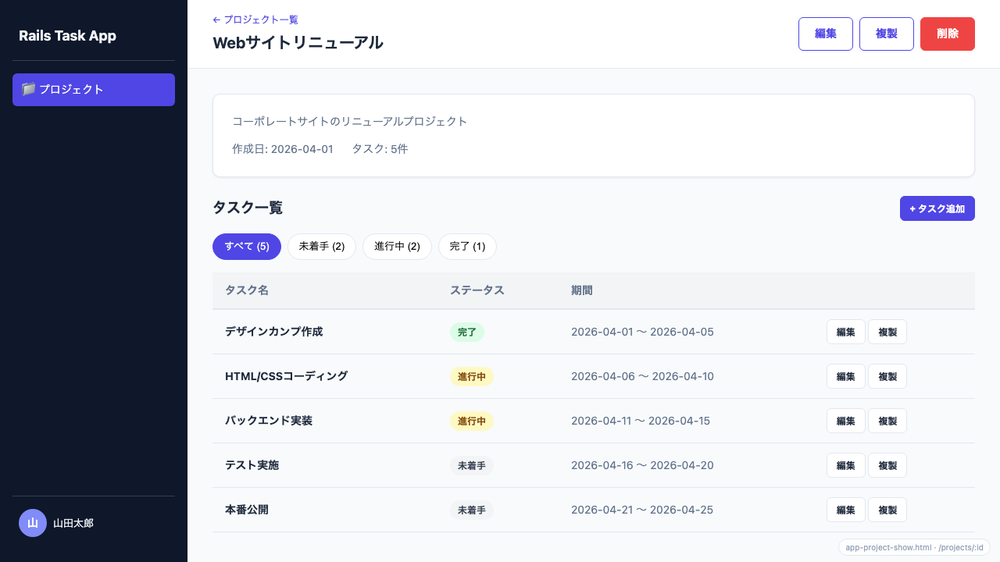
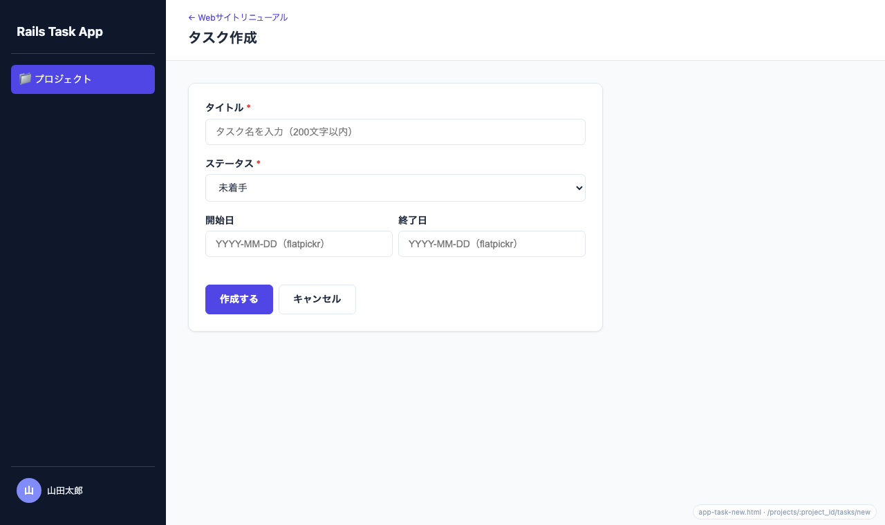
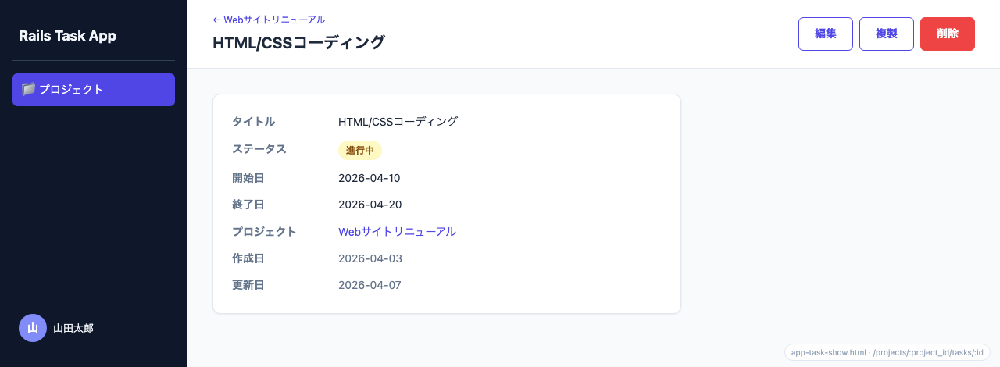

# Rails Task Web App

[](https://github.com/kojikawazu/rails-practice-web-app/actions/workflows/ci.yml)


[](LICENSE)

> タスク管理ドメインを **フルスタック / API モードの 2 構成**で実装した Rails 学習用プロジェクト。同じドメインを 2 通りで作り、その**差分**から Rails の規約と API 設計を体感することが目的です。

## 目次

- [Overview](#overview)
- [スクリーンショット](#スクリーンショット)
- [技術的ハイライト](#技術的ハイライト)
- [Features](#features)
- [Tech Stack](#tech-stack)
- [Quick Start](#quick-start)
- [Directory Structure](#directory-structure)
- [Test / CI](#test--ci)
- [Docs](#docs)
- [License](#license)

## Overview

同じドメイン（タスク管理）で 2 つの構成を構築し、差分で学びます。

| プロジェクト | ディレクトリ | 構成 |
|---|---|---|
| Project 1: フルスタック | `rails-task-fullstack-web-app/` | ERB/View 込みのフルスタック（Turbo/Stimulus・セッション認証） |
| Project 2: API モード | `rails-task-api-web-app/` | JSON API のみ（JWT 認証） |

両プロジェクトとも実装・テスト済みで、ローカルで起動できます（[Quick Start](#quick-start) 参照）。

## スクリーンショット

フルスタック版の画面（画像は `docs/13-mockups/` のモックを元にしたイメージ）。

| プロジェクト一覧 | プロジェクト詳細（タスク一覧＋ステータスフィルタ） |
|---|---|
|  |  |

| タスク作成フォーム | タスク詳細 |
|---|---|
|  |  |

> 全画面のモックはブラウザで `docs/13-mockups/index.html` を開くと一覧できます。

## 技術的ハイライト

単純な CRUD に留めず、現場で頻出する「難しさ」をあえて作り込んでいます（いずれもフルスタック版）。

- **確認画面フロー（入力 → 確認 → 確定）** — DB に保存せずメモリ上で `valid?` だけ実行して確認画面を描画。プロジェクト新規作成のみ **PRG（Post/Redirect/Get）+ Turbo Drive** で実装し、リロード安全性と白画面回避を両立。他は `data: { turbo: false }` でフルページ遷移。→ [機能仕様](docs/03-functional-specification.md#確認画面登録作成編集)
- **画像添付の round-trip** — HTML の file input は確認画面の hidden で値を持ち回れないため、確認ステップで一旦 blob 化し `signed_id` を「修正する」「確定」で持ち回る（JS 不要・オーファン防止）。Active Storage + MinIO（S3 互換）。→ [データ仕様](docs/05-data-specification.md#画像添付active-storage)
- **外部 URL プレビューの iframe 多層防御** — 任意のユーザー入力 URL を確認画面で iframe プレビューする際、**スキーム検証（http/https のみ）＋ sandbox ＋ 内部/プライベート IP 拒否**でサンドボックス脱獄・トップナビ乗っ取り・XSS を抑止。→ [セキュリティ仕様](docs/06-security-specification.md#外部-url-のプレビューiframe-埋め込み)
- **認可スコープ** — 他ユーザーのリソースへアクセスすると 404（`current_user.projects.find(...)`）。フルスタックはリダイレクト、API は 401 と挙動を作り分け。
- **変更内容で発火条件を分ける CI** — GitHub Actions のパスフィルタで、コード変更にはテスト、ドキュメント変更には markdown lint と、関係のあるジョブだけを実行。スキップされたジョブは required check 上で成功扱いとなり、マージをブロックしない。

## Features

タスク管理ドメインを題材に、両プロジェクト共通で以下を実装しています。

- ユーザー登録・ログイン / ログアウト（フルスタック版 = セッション、API モード = JWT）
- プロジェクトの CRUD（一覧・詳細・作成・編集・削除）
- タスクの CRUD + ステータス管理（未着手 / 進行中 / 完了）
- 認可スコープ（他ユーザーのリソースへアクセスすると 404）

フルスタック版のみ:

- **確認画面フロー**（入力 → 確認 → 確定。「修正する」で入力値を保持）
- **タスク画像添付**（Active Storage + MinIO・複数枚＋サムネ）
- プロジェクト / タスクの複製
- 外部 URL プレビューの iframe 多層防御

機能の詳細は [docs/03-functional-specification.md](docs/03-functional-specification.md) を参照。

## Tech Stack

| カテゴリ | 技術 |
|---|---|
| 言語 | Ruby 3.3.11 |
| フレームワーク | Ruby on Rails 8.1.3 |
| データベース | PostgreSQL 16（Docker） |
| 画像ストレージ | Active Storage + MinIO（S3 互換 / Docker） |
| フロント（フルスタック版） | Turbo / Stimulus（Importmap）+ ERB |
| 認証 | セッション（フルスタック版）/ JWT（API モード） |
| テスト | RSpec, FactoryBot, Shoulda Matchers, Capybara（system spec） |
| CI | GitHub Actions |

## Quick Start

clone 後、以下で両アプリを起動できます（`make` ショートカット利用。全 target は `make help`）。

### 前提条件

| 必要なもの | 備考 / インストール例 |
|---|---|
| Ruby 3.3.11 | rbenv 推奨: `rbenv install 3.3.11`（`.ruby-version` で固定） |
| Bundler | `gem install bundler` |
| Docker / Docker Compose | PostgreSQL・MinIO の起動に使用 |
| Git | — |
| ImageMagick または libvips | 画像サムネイル生成用: `brew install imagemagick` |

### 起動手順

```bash
make up                          # PostgreSQL + MinIO 起動（.env 自動生成・MinIO バケット自動作成）

# フルスタック版 → http://localhost:3099
cd rails-task-fullstack-web-app
bundle install
bin/rails db:prepare
bin/rails server -p 3099

# API モード → http://localhost:3100（別ターミナルで）
cd rails-task-api-web-app
bundle install
bin/rails db:prepare
bin/rails server -p 3100
```

> **2 構成を同時に動かす場合はターミナルを分けてください**（`rails server` はフォアグラウンドで動き続けます）。
> **初回はデータが空です**。フルスタック版は <http://localhost:3099> を開いて「ユーザー登録」から開始してください。API モードのログイン手順（curl）は [docs/12-code-reading-guide/](docs/12-code-reading-guide/README.md#apiモード) を参照。

| サービス | URL / ポート |
|---|---|
| フルスタック版 | <http://localhost:3099> |
| API モード | <http://localhost:3100> |
| PostgreSQL | 5434 |
| MinIO（API / コンソール） | <http://localhost:9000> / <http://localhost:9001> |

> **画像ストレージ（MinIO）**: フルスタック版のタスク画像添付は Active Storage + MinIO（S3 互換）を使います。`make up` で MinIO が起動し、`createbuckets` コンテナがバケットを自動作成します。認証情報は `.env`（`MINIO_ROOT_USER` / `AWS_ACCESS_KEY_ID` 等）で管理します。

## Directory Structure

```text
rails-practice-web-app/
├── .github/workflows/ci.yml       # GitHub Actions（テスト CI）
├── CLAUDE.md
├── README.md
├── LICENSE                        # MIT
├── Makefile                       # 開発用タスクランナー（make help で一覧）
├── docker-compose.yml             # PostgreSQL + MinIO コンテナ定義
├── .env                           # DB接続情報・MinIO 認証情報（git管理外）
├── .env.example                   # 環境変数テンプレート
├── docs/                          # 仕様書・設計資料（docs/README.md が索引）
│   ├── 01〜11-*.md                 # 各種仕様書（要求・要件・機能・非機能・データ ほか）
│   ├── 12-code-reading-guide/      # コードリーディングガイド（Step 別）
│   ├── 13-mockups/                 # HTML モック画面
│   ├── 14-design/                  # 開発設計実装方針（トピック別）
│   ├── 15-test-design/             # テスト設計（分類別）
│   └── screenshots/                # README 用スクリーンショット
├── rails-task-fullstack-web-app/  # Project 1: フルスタック
└── rails-task-api-web-app/        # Project 2: API モード
```

## Test / CI

GitHub Actions（`.github/workflows/ci.yml`）で、`main` への push と全 PR で**両プロジェクトのテスト**を自動実行します（デプロイは対象外）。

| ジョブ | 内容 | 実行条件 |
|---|---|---|
| `Detect changes` | 差分パスを判定し、変更範囲（`code` / `docs`）を後続ジョブへ渡す軽量ジョブ | 常時 |
| `Markdown lint` | markdownlint-cli2 でリポジトリ全体の markdown を検証 | ドキュメント変更時 |
| `Test (matrix)` | 両アプリで Minitest（`bin/rails test`）+ RSpec（`bundle exec rspec`） | コード変更時 |
| `System (:js)` | フルスタック版の JS system spec（`rspec --tag js`、headless Chrome） | コード変更時 |

ローカル実行（`make` ショートカット推奨。全 target は `make help` で一覧）:

```bash
make up            # PostgreSQL + MinIO 起動（.env 自動生成）
make db-prepare    # テスト用 DB 準備（既定: fullstack。APP= で切替）
make test          # Minitest + RSpec（既定アプリ）
make test-all      # 両アプリでテスト
make test-js       # JS system spec（fullstack のみ、要 Chrome）
make ci            # ローカル CI 一括（rubocop + security + tests）
make lint-md       # markdownlint（CI と同一設定。自動修正は make lint-md-fix）
```

`make` を使わない場合の素のコマンド:

```bash
make up                                       # PostgreSQL 起動（ルートで）
cd rails-task-fullstack-web-app
bin/rails db:test:prepare
bundle exec rspec                             # 通常スイート（JS 除外）
bundle exec rspec --tag js                    # JS system spec（要 Chrome）
```

> ドキュメントのみの変更（`docs/**` / `**.md` / `.claude/**` 等、コード外）では、`Detect changes` が `code=false` と判定し、重い `Test` / `System` ジョブを **`if` 条件でスキップ**します。`paths-ignore` と違いワークフロー自体は起動するため、スキップされたジョブは required check 上で成功扱いとなり、ブランチ保護を有効にしてもマージがブロックされません。

## Docs

仕様書は `docs/` 配下に番号付きで整理しています。**全文書の索引は [docs/README.md](docs/README.md) を参照**してください。以下はよく参照するもののクイックリンクです。

| 知りたいこと | 参照先 |
|---|---|
| **全ドキュメント索引** | [docs/README.md](docs/README.md) |
| **コンテナ構成・アーキテクチャ** | [docs/09-architecture-specification.md](docs/09-architecture-specification.md) |
| **DB（ER 図・テーブルスキーマ・Active Storage）** | [docs/05-data-specification.md](docs/05-data-specification.md) |
| **セキュリティ**（認証・認可・preview_url の iframe 防御） | [docs/06-security-specification.md](docs/06-security-specification.md) |
| **API エンドポイント一覧**（JWT 認証） | [docs/07-api-specification.md](docs/07-api-specification.md) |
| **起動コマンド・2 構成の差分を読み比べる** | [docs/12-code-reading-guide/](docs/12-code-reading-guide/README.md) |
| **進捗・タスク** | [docs/11-tasks.md](docs/11-tasks.md) |
| **画面モック一覧** | `docs/13-mockups/index.html`（ブラウザで開く） |

## License

[MIT License](LICENSE) © 2026 kojikawazu

学習目的の個人プロジェクトです。
