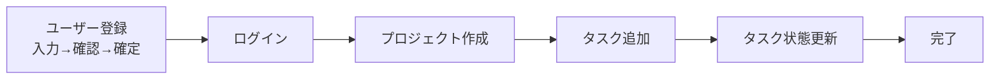
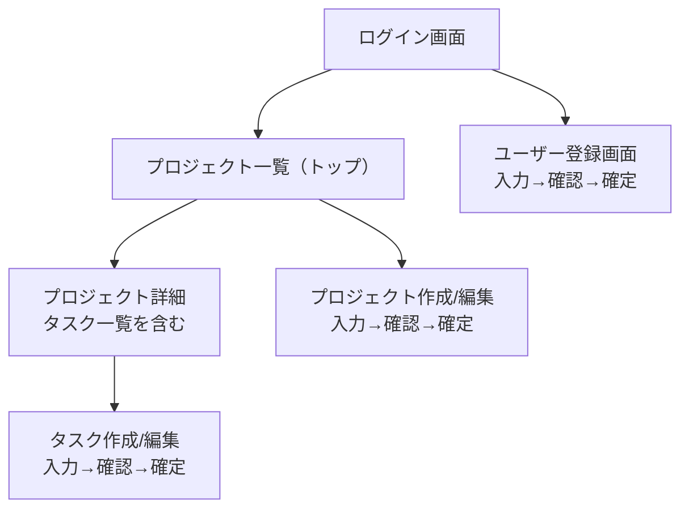
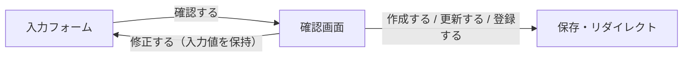

# 機能仕様書（Functional Specification）

## 目次

- [機能詳細](#機能詳細)
  - [認証機能](#認証機能)
  - [プロジェクト管理](#プロジェクト管理)
  - [タスク管理](#タスク管理)
- [ユーザーフロー](#ユーザーフロー)
  - [基本フロー](#基本フロー)
  - [画面遷移](#画面遷移)
  - [確認画面（登録・作成・編集）](#確認画面登録作成編集)
- [UI/UX 仕様](#uiux-仕様)
- [ビジネスロジック](#ビジネスロジック)
  - [バリデーション](#バリデーション)
  - [ステータス遷移](#ステータス遷移)

## 機能詳細

### 認証機能

- `has_secure_password` を使用（Deviseは使わない）
- セッションベースの認証を手書きで実装
- ログイン状態の管理は `session[:user_id]` で行う

### プロジェクト管理

- ログインユーザーに紐づくプロジェクトのみ表示・操作可能
- プロジェクト削除時、紐づくタスクも連動削除（`dependent: :destroy`）
- 複製: 既存プロジェクトの内容（タイトル・説明）を引き継いだ新規作成フォームを開く（本体のみ。配下タスクは複製しない）

### タスク管理

- プロジェクトに紐づくタスクのCRUD
- ステータス: `not_started`（未着手）/ `in_progress`（進行中）/ `completed`（完了）。値の変更は[ステータス遷移](#ステータス遷移)の規則に従う（任意の状態へ直接変更はできない）
- 開始日・終了日（start_date / end_date）の設定が可能（任意・入力時は終了日 >= 開始日）。日付選択は flatpickr を使用し、終了日の選択可能範囲を開始日に連動させる
- 画像添付: タスクに画像を複数枚添付できる（png / jpeg / gif / webp・1枚5MBまで）。Active Storage + MinIO（S3 互換）で保存し、詳細画面でサムネイル表示・個別削除が可能。アップロードは**新規/編集フォームから行い、確認画面フローに合流する**（フルスタック版のみ）
- プレビュー URL: タスクに参考リンク（`preview_url`）を任意で1件設定できる。**http / https のみ許可**（モデルで検証）。確認画面では sandbox 化した iframe で内容をプレビュー表示し、詳細画面では `rel="noopener noreferrer"` の安全リンクのみ表示する（フルスタック版のみ。セキュリティ方針は `06-security-specification.md` 参照）
- 複製: 既存タスクの内容（タイトル・開始日・終了日）を引き継いだ新規作成フォームを開く。**ステータスは引き継がない**（新規作成は未着手固定のため）

> 複製は「複製元の値を初期入力した新規作成フォーム」を表示する操作で、保存処理は通常の作成（確認画面）フローに合流する。複製時はタイトルに「〜のコピー」を付与する。対象はフルスタック版のみ。

## ユーザーフロー

### 基本フロー



### 画面遷移



### 確認画面（登録・作成・編集）

ユーザー登録・プロジェクト作成/編集・タスク作成/編集では、保存前に確認画面を挟む。



- 確認画面では DB に保存せず、メモリ上で `valid?` のみ実行する（確認内容＝実際に保存される内容）。
- バリデーションエラー時は確認画面に進まず、入力フォームをエラー付きで再表示する（HTTP 422）。
- 「修正する」は入力値を保持したまま入力フォームへ戻る。
- パスワードは確認画面では `••••••` でマスク表示する（学習用途のため値は hidden で保持）。
- 対象はフルスタック版のみ。API モードは画面が無いため対象外。
- **Turbo 対応**: 確認画面は POST に対し別ページを 200 で描画するパターンのため、該当フォームは `data: { turbo: false }`（Turbo Drive 無効・フルページ遷移）とする。Turbo Drive は非リダイレクトの 200 応答を破棄するため、有効のままだと確認画面に遷移できない。削除ボタンの `turbo_confirm` ダイアログは Turbo が必要なため無効化しない。
- **プロジェクト新規作成のリダイレクト方式（PRG / 例外）**: **プロジェクト新規作成のみ**、確認ステップを PRG（Post/Redirect/Get）で実装する。`confirm`(POST) は `valid?` 後に入力値を `session[:pending_project]` へ退避して `confirm`(GET) へ 303 リダイレクトし、`confirm`(GET) が session から確認画面を描画する（session 不在時は `new` へ戻す＝リロード安全網）。これにより Turbo Drive を有効化でき（白画面なし）、確認画面のリロードも安全になる。「修正する」は session が入力値を保持するため GET リンク（`new?restore=1`）でフォームへ戻る。リダイレクト方式は JS 非依存で、Turbo は白画面除去の上乗せにすぎない。**対象は新規のみ**で、プロジェクト編集・タスク・ユーザー登録は従来の `turbo: false` フルページ遷移（上記）のまま。複数タブで新規作成を同時に行うと session 退避が上書きされる制約があるが、単一ユーザー学習用途のため許容する。
- **画像の round-trip**: HTML の file input は確認画面の hidden で値を持ち回れないため、タスクの画像は確認ステップで一旦サーバー経由で blob 化し、`signed_id`（hidden）を「修正する」「確定」で持ち回る（JS 不要）。確定時に `signed_id` を attach する。不正な形式・サイズのファイルは確認ステップで弾き、blob を生成しない（オーファン防止）。編集では既存添付の削除予約（`remove_image_ids`）も同様に round-trip する。
- **確認画面は POST 専用**: `turbo: false` のフルページ POST のため、確認画面 URL をリロード/戻る操作で GET すると `show` ルートへ誤って落ちる。これを防ぐため確認ルートは GET も受け、GET 時は入力フォーム（新規/編集）へリダイレクトする。

## UI/UX 仕様

- ERBテンプレートによるサーバーサイドレンダリング（Project 1）
- Railsデフォルトのレイアウト構成（`application.html.erb`）
- サイドバー + メインエリアのレイアウト（モック画面参照: `docs/13-mockups/`）
- フラッシュメッセージで操作結果をフィードバック
- フォームは `form_with` ヘルパーを使用
- 認証系画面（ログイン・登録）は中央寄せの単体レイアウト

## ビジネスロジック

### バリデーション

| モデル | フィールド | ルール |
|--------|-----------|--------|
| User | name | presence, length(max: 50) |
| User | email | presence, uniqueness, format |
| User | password | presence, length(min: 6) |
| Project | title | presence, length(max: 100) |
| Project | user_id | presence |
| Task | title | presence, length(max: 200) |
| Task | status | presence, inclusion(not_started, in_progress, completed), 遷移規則（[ステータス遷移](#ステータス遷移)） |
| Task | project_id | presence |

### ステータス遷移

**この遷移図は業務制約であり、実装で強制する**（説明用の典型例ではない）。

```text
not_started → in_progress → completed
                ↑                |
                └────────────────┘ (差し戻し可)
```

| 現在の状態 | 変更できる状態 |
|---|---|
| （新規作成） | `not_started` のみ |
| `not_started` | `in_progress` |
| `in_progress` | `completed` |
| `completed` | `in_progress`（差し戻し） |

- ステータスを変更しない更新（タイトルだけの変更など）は、どの状態でも行える。
- 禁止される例: `not_started → completed`（途中を飛ばす）/ `in_progress → not_started` / `completed → not_started`（一気に起点へ戻す）/ 新規作成時に `in_progress`・`completed` を指定する。
- **担保はモデル**（`Task::ALLOWED_STATUS_TRANSITIONS` と作成/更新のバリデーション）。フォーム・API・コンソールのどの入口から来ても同じ規則で拒否する（両アプリ共通）。
- **UI（フルスタック版）**: 新規作成フォームはステータスを選ばせず「未着手」固定を表示し、編集フォームは現在の状態と許可された遷移先だけを選択肢に出す。UI で塞ぐのは誤操作を減らすためで、規則の担保はモデル側にある（多層防御）。
- **違反時**: フルスタック版はフォームを 422 で再描画しエラーを表示、API 版は `422` と `{ "errors": [...] }` を返す（`07-api-specification.md`）。
